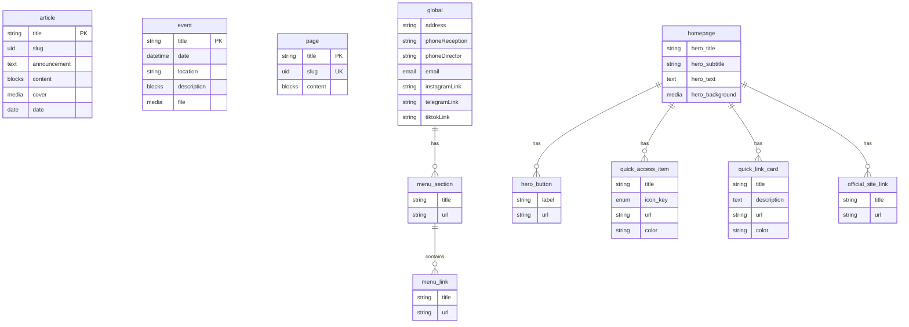
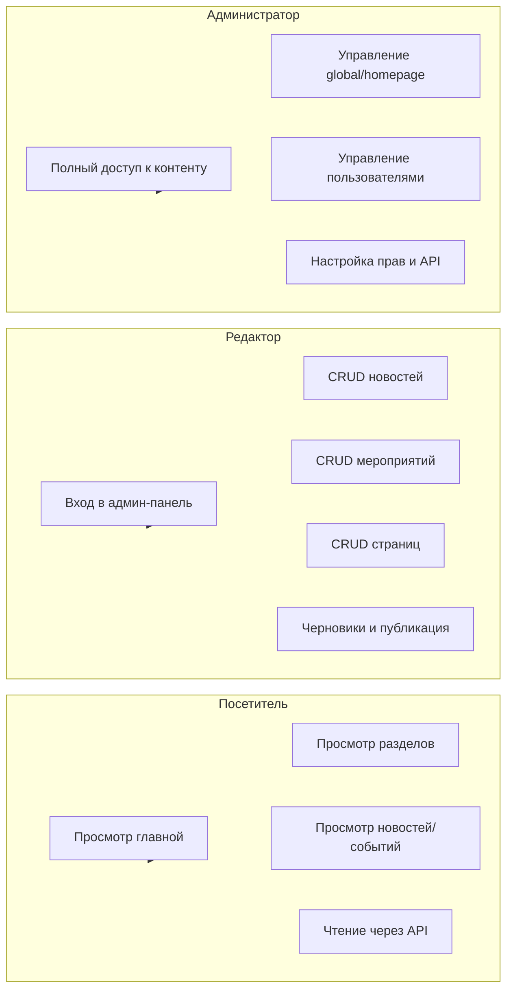

# Глава 2. ПРОЕКТИРОВАНИЕ СИСТЕМЫ

## 2.1 Постановка требований

Проектирование официального веб-сайта Оршанского колледжа – филиала УО «БелГУТ» опирается на чёткую фиксацию требований к системе. Без этого этапа дальнейшая разработка архитектуры и модели данных теряет ориентиры. В данном подразделе формулируются функциональные и нефункциональные требования, а также требования по доступности с учётом нормативной базы Республики Беларусь и международных рекомендаций. По сути требования задают границы того, что проектируемая система должна уметь делать и какими свойствами обладать.

Актуальность постановки задачи на новый сайт колледжа укладывается в рамки государственной программы «Цифровая Беларусь» на 2026–2030 годы [1] и предшествующей программы «Цифровое развитие Беларуси» на 2021–2025 годы [2]. В этих документах закреплены направления цифровизации страны, в том числе в сфере образования. Официальный сайт учреждения образования рассматривается как один из ключевых каналов представления информации и взаимодействия с гражданами. Соответственно разработка современного, управляемого и доступного сайта соответствует целям госпрограмм. Концепция обеспечения суверенитета Республики Беларусь в сфере цифрового развития до 2030 года [3] дополнительно задаёт требование к контролю над инфраструктурой и данными. Проектируемая система планируется к развёртыванию на собственной инфраструктуре колледжа или отечественного хостинга, что согласуется с данной концепцией.

**Функциональные требования** описывают, какие возможности должна предоставлять система пользователям и администраторам. Для посетителей сайта предусматривается просмотр главной страницы с актуальными блоками (приветственный блок, новости, события, быстрые ссылки), навигация по разделам (О колледже, Абитуриентам, Обучающимся, Воспитательная работа, Одно окно, Электронные обращения), просмотр новостей и событий, получение информации о специальностях, контактах, документах и административных процедурах. В структуре предусмотрено динамическое главное меню, формируемое из данных серверной части системы управления контентом, чтобы при добавлении или изменении разделов не требовалось править код клиентской части. Для персонала колледжа, работающего через административную панель управления контентом (Strapi), планируется реализовать управление новостями (создание, редактирование, публикация, хранение заголовка, анонса, основного текста, обложки и даты), управление мероприятиями (название, дата и время, место, описание, при необходимости файл), управление статическими страницами (заголовок, адрес страницы-slug, контент), настройку глобальных параметров (главное меню, контакты, ссылки на соцсети), а также настройку блоков главной страницы (приветственный блок, панель быстрого доступа, блок полезной информации, блок официальных сайтов). Формы обратной связи в проекте не предусмотрены; сбор персональных данных через формы на сайте не входит в текущий объём требований.

**Нефункциональные требования** задают качественные характеристики системы. Надёжность: серверная и клиентская части должны устойчиво работать в условиях типичной нагрузки сайта учреждения образования (сотни и тысячи просмотров в день). Производительность: время первой отрисовки страницы и отклик интерфейса должны быть приемлемыми для пользователей; применение серверного рендеринга в клиентской части (Next.js) как раз направлено на быструю выдачу готового HTML. Масштабируемость: архитектура не должна препятствовать увеличению объёма контента и при необходимости ресурсов сервера. Безопасность: доступ к административной панели только для авторизованных лиц; публичное API для чтения контента не должно раскрывать служебные данные; развёртывание планируется в контуре учреждения или на доверенном хостинге. Адаптивная вёрстка обязательна: сайт должен корректно отображаться на устройствах с разной шириной экрана (мобильные телефоны, планшеты, настольные компьютеры), что закладывается в проектирование UI-кита и сетки страниц.

**Требования по доступности** заданы стандартом СТБ 2105-2010 [5] «Интернет-ресурсы. Требования доступности для инвалидов по зрению» и международными рекомендациями WCAG 2.1 [6]. В проектируемой системе будет обеспечено наличие режима для слабовидящих: возможность увеличения размера шрифта, повышения контрастности, отключения или упрощения декоративных изображений, навигации с клавиатуры и соблюдения структуры заголовков и альтернативных описаний для значимых изображений. Эти аспекты детализируются в подразделе 2.6. Соответствие СТБ 2105-2010 и принципам WCAG 2.1 входит в перечень обязательных требований к официальному сайту учреждения образования в РБ, как отмечено в главе 1 [4, 5, 6].

Для наглядности и контроля прослеживаемости требований в проектировании используется матрица требований. В ней требования сопоставляются с компонентами системы и этапами реализации. Пример такой матрицы приведён в таблице 2.1.1.

*Таблица 2.1.1 — Матрица требований к проектируемой системе*

| Идентификатор | Формулировка требования | Тип | Компонент / этап | Источник |
|---------------|-------------------------|-----|------------------|----------|
| ТР-01 | Управление новостями (создание, редактирование, публикация) | Функциональное | Серверная часть CMS (Strapi), тип контента article | Задание на проект |
| ТР-02 | Управление мероприятиями (дата, место, описание, файл) | Функциональное | Серверная часть CMS, тип контента event | Задание на проект |
| ТР-03 | Управление статическими страницами (заголовок, slug, контент) | Функциональное | Серверная часть CMS, тип контента page | Задание на проект |
| ТР-04 | Динамическое главное меню из данных CMS | Функциональное | Global-настройки, клиентская часть (layout) | Структура сайта |
| ТР-05 | Настраиваемые блоки главной страницы (Hero, быстрые ссылки и др.) | Функциональное | Single Type homepage, клиентская часть | Структура отчёта |
| ТР-06 | Адаптивное отображение на мобильных и десктопах | Нефункциональное | UI-кит, Tailwind CSS | НПА, практика |
| ТР-07 | Режим для слабовидящих (шрифт, контраст, изображения) | Нефункциональное / доступность | Клиентская часть, стили, переключатель | СТБ 2105-2010 [5], WCAG 2.1 [6] |
| ТР-08 | Развёртывание на собственной инфраструктуре / on-premise | Нефункциональное | Инфраструктура, Strapi, Next.js | Концепция [3], госпрограммы [1, 2] |

Матрицу можно расширять по мере детализации проектирования. Ссылки на источники (задание, структура отчёта, НПА) обеспечивают прослеживаемость от требований к реализации.

**Вывод по подразделу 2.1.** Постановка требований к проектируемой системе включает функциональные (управление контентом, динамическое меню, настраиваемые блоки главной; формы обратной связи не предусмотрены), нефункциональные (надёжность, производительность, масштабируемость, безопасность, адаптивная вёрстка) и требования по доступности в соответствии со СТБ 2105-2010 [5] и WCAG 2.1 [6]. Требования согласованы с госпрограммами «Цифровая Беларусь» [1] и «Цифровое развитие Беларуси» [2], а также с Концепцией суверенитета в сфере цифрового развития [3]. Матрица требований фиксирует прослеживаемость к компонентам системы и источникам.

---

## 2.2 Информационная архитектура

Информационная архитектура проектируемого сайта определяет состав страниц, иерархию разделов и логику переходов пользователя. От неё зависят навигация, размещение контента и возможность быстрого поиска информации целевыми аудиториями: абитуриентами, студентами, преподавателями и партнёрами. В данном подразделе описывается структура разделов на основе принятой архитектуры сайта, логика переходов между разделами и страницами, а также визуализация в виде карты сайта (Sitemap).

Структура проектируемого сайта строится по принципу двухуровневой шапки. Верхний уровень отводится под брендинг и служебные функции: логотип учреждения образования (слева), поиск по сайту (иконка), версия для слабовидящих (иконка). Второй уровень — главное меню с пунктами: Новости, О колледже, Абитуриентам, Обучающимся, Воспитательная работа, Одно окно, Электронные обращения. Такое разделение позволяет вынести ключевые разделы на первый план и сохранить быстрый доступ к поиску и режиму для слабовидящих без перегрузки меню. Логика переходов предполагает, что с главной страницы пользователь может перейти в любой из разделов верхнего уровня, а внутри разделов — к подразделам по иерархии. Обратный переход обеспечивается через главное меню и при необходимости хлебные крошки (breadcrumbs), что в проектировании предусмотрено для многоуровневых разделов.

Раздел «О колледже» в структуре предусматривает подразделы: Администрация, Контакты и схема проезда, Государственные символы и символика колледжа, Профилактика коррупционных правонарушений, Платные услуги, История колледжа (с упоминанием музея). Каждый подраздел соответствует отдельной странице или группе страниц; контент будет храниться в статических страницах (тип page) или в настраиваемых блоках, управляемых через серверную часть CMS. Раздел «Абитуриентам» включает: Специальности, План приёма, Документы для подачи в комиссию, Информация о свободных местах (перевод и восстановление). Здесь планируется выводить как контент из Strapi (страницы, списки специальностей при их выносе в отдельный тип контента), так и при необходимости ссылки на внешние ресурсы. Раздел «Обучающимся» структурирован по формам обучения и подразделениям: дневное отделение (расписание занятий, графики образовательного процесса), заочное отделение (график сессий, объявления), общежитие (новости общежития, правила проживания). Переходы внутри раздела строятся по принципу «общая страница раздела — подраздел — конкретная информация».

Раздел «Воспитательная работа» в архитектуре включает: СППС (психолог и социальный педагог), Молодёжная политика (БРСМ, Кодекс чести, кружки и секции), В помощь куратору. Раздел «Одно окно» проектируется как посадочная страница с информацией об административных процедурах, графике приёма граждан и аналогичных сведениях. Раздел «Электронные обращения» ведёт к странице с информацией о порядке обращений и при необходимости ссылками на государственные сервисы (например, Обращения.бел). Главная страница проектируется с учётом трёх зон: Hero-блок (первый экран с изображением фасада колледжа, полным названием и ключевыми кнопками, например «Подать документы»), имиджевый блок (преимущества и ключевые ценности колледжа — несколько плиток с иконками), блок «Актуальное» (новости и календарь событий). Ниже предусмотрена плавающая или статичная панель быстрого доступа с динамически редактируемыми элементами (по умолчанию: Расписание, Одно окно, Навигация для слабовидящих; сезонно может добавляться, например, ход приёмной комиссии). Логика переходов с главной страницы: пользователь может сразу перейти по кнопкам Hero в наиболее востребованные разделы, через панель быстрого доступа — к расписанию, одно окно и версии для слабовидящих, через блок новостей — к списку новостей и отдельной новости.

Навигационные сценарии для разных ролей в проектировании учитываются следующим образом. Посетитель (абитуриент, студент, гость) перемещается только по публичной части: главная, разделы, новости, события, страницы. Редактор и администратор дополнительно работают с административной панелью Strapi; на навигацию по публичному сайту роли не влияют. Для слабовидящих пользователей в структуре предусмотрен отдельный переключатель режима отображения; навигация остаётся той же, меняются только визуальные параметры (размер шрифта, контраст, изображения).

Для наглядного представления структуры сайта используется диаграмма «Карта сайта» (Sitemap). Ниже приведён код диаграммы в формате Mermaid, который можно отобразить в редакторах, поддерживающих Mermaid (например, в документации или в отчёте при конвертации в поддерживаемый формат).

*Листинг 2.2.1 — Код диаграммы «Карта сайта» (Mermaid)*

```mermaid
flowchart TB
    Home["Главная страница"]
    Home --> News["Новости"]
    Home --> About["О колледже"]
    Home --> Applicants["Абитуриентам"]
    Home --> Students["Обучающимся"]
    Home --> Ideology["Воспитательная работа"]
    Home --> OneWindow["Одно окно"]
    Home --> Appeals["Электронные обращения"]

    About --> AboutAdmin["Администрация"]
    About --> AboutContacts["Контакты и схема проезда"]
    About --> AboutSymbols["Государственные символы"]
    About --> AboutCorruption["Профилактика коррупции"]
    About --> AboutServices["Платные услуги"]
    About --> AboutHistory["История колледжа"]

    Applicants --> AppSpec["Специальности"]
    Applicants --> AppPlan["План приёма"]
    Applicants --> AppDocs["Документы для комиссии"]
    Applicants --> AppTransfer["Свободные места"]

    Students --> StudDay["Дневное отделение"]
    Students --> StudCorr["Заочное отделение"]
    Students --> StudDorm["Общежитие"]

    Ideology --> IdeologySPPS["СППС"]
    Ideology --> IdeologyYouth["Молодёжная политика"]
    Ideology --> IdeologyCurator["В помощь куратору"]

    News --> NewsList["Список новостей"]
    NewsList --> NewsItem["Новость / slug"]
    OneWindow --> OWPage["Страница Одно окно"]
    Appeals --> AppealsPage["Страница Обращения"]
```



*Рисунок 2.2.1 — Карта сайта (Sitemap). Рекомендуется вставить в отчёт визуализацию по коду листинга 2.2.1.*

Иерархия отражает переход от главной страницы к разделам первого уровня и далее к подразделам. Страницы новостей и событий получают динамические адреса (например, по slug или id), что в диаграмме обозначено как «Новость / slug». Аналогично при наличии раздела событий в карту можно добавить узел «События» и «Событие / id».

**Вывод по подразделу 2.2.** Информационная архитектура проектируемого сайта включает двухуровневую шапку (брендинг и служебные функции, главное меню), разделы О колледже, Абитуриентам, Обучающимся, Воспитательная работа, Одно окно и Электронные обращения с детализированными подразделами. Главная страница проектируется с Hero-блоком, блоком преимуществ, блоком «Актуальное» (новости и календарь) и панелью быстрого доступа. Логика переходов строится на иерархии раздел — подраздел — страница; для визуализации используется карта сайта (Sitemap), код которой приведён в листинге 2.2.1.

---

## 2.3 Проектирование схемы БД и модели данных в Strapi

Серверная часть системы управления контентом (Strapi) хранит весь контент, который отображается на сайте. Проектирование схемы данных направлено на то, чтобы практически весь визуально значимый контент находился в Strapi и редакторы могли менять тексты, ссылки, иконки и состав блоков без правок кода клиентской части. В данном подразделе описываются коллекции (Collection Types) и единичные типы (Single Types), компоненты, типы полей, связи, а также приводятся ER-диаграмма и пример JSON-схемы одной из моделей.

**Коллекции (Collection Types).** В проектируемой системе предусмотрены три основные коллекции. *Article* (новости): каждая запись соответствует одной новости. Планируются поля: title (String, обязательное) — заголовок; slug (UID, от title) — адрес страницы новости; announcement (Text, обязательное) — краткий анонс; content (Blocks) — основной текст в формате блоков (абзацы, заголовки, списки, вложения); cover (Media, один файл, тип images) — обложка новости; date (Date) — дата публикации. Включение черновиков и публикации (draft and publish) позволит готовить материалы до выхода в свет. *Event* (мероприятия/события): title (String), date (DateTime, обязательное), location (String), description (Blocks), file (Media, images или files). Коллекция предназначена для анонсов мероприятий, сессий, собраний. *Page* (статические страницы): title (String), slug (UID, обязательное), content (Blocks). Используется для разделов типа «История колледжа», «Контакты», «Администрация» и т.п., когда нужна одна страница с произвольной разметкой.

**Единичные типы (Single Types).** *Global* — глобальные настройки сайта в единственном экземпляре. В структуре предусмотрены: mainMenu (повторяемый компонент elements.menu-section) — главное меню; поля контактов (address, phoneReception, phoneDirector, email) и ссылки на соцсети (instagramLink, telegramLink, tiktokLink). Компонент menu-section содержит: title (String), url (String), links (повторяемый компонент elements.menu-link). Компонент menu-link: title (String), url (String). Таким образом меню строится как список разделов, каждый из которых может содержать подпункты. *Homepage* — единственная запись с настройками главной страницы. В проектировании закладываются: Hero-блок (заголовок, подзаголовок-бейдж, основной текст, фоновое изображение, повторяемый компонент «кнопка/ссылка» с названием и URL); панель быстрого доступа — повторяемый компонент с полями название, ключ иконки (enum из предопределённого набора), ссылка, цветовая метка; блок «Полезная информация» (быстрые ссылки): заголовок секции и повторяемые карточки (название, краткое описание, ссылка, цвет полоски); блок официальных (государственных) сайтов: заголовок блока и повторяемый компонент (название, URL) для размещения в подвале или отдельной секции. Иконки панели быстрого доступа задаются через enum (расписание, одно окно, приёмная, слабовидящим и др.); в клиентской части ключу ставится в соответствие компонент иконки (например, из набора Lucide), что позволяет менять подпись и ссылку в Strapi без изменения кода.

**Типы полей.** В проектировании используются: String, Text, UID, Date, DateTime, Email — для простых данных; Media (один или несколько файлов, ограничение по типам images/files) — для обложек и вложений; Blocks — для богатого текста (Rich Text в формате блоков Strapi); компоненты (component, repeatable: true/false) — для вложенных структур (меню, Hero-кнопки, карточки быстрых ссылок). Такой набор покрывает потребности колледжа в текстовом и медиа-контенте и настраиваемых блоках.

**Связи и расширяемость.** Явные связи между коллекциями в первой очереди не обязательны: новости, события и страницы автономны. Связь реализуется через общую навигацию (global.mainMenu) и при необходимости привязку пунктов меню к slug страниц или внешним URL. Медиафайлы хранятся в Strapi и связываются с полями типа Media. Расширяемость обеспечивается за счёт добавления новых полей или компонентов в существующие типы контента и создания новых Collection Types без перестройки общей архитектуры.

Ниже приведён код ER-диаграммы в формате Mermaid, отражающей сущности и их атрибуты (упрощённо; компоненты показаны как сущности).

*Листинг 2.3.1 — Код ER-диаграммы модели данных (Mermaid)*



*Рисунок 2.3.1 — ER-диаграмма модели данных. Рекомендуется вставить в отчёт визуализацию по коду листинга 2.3.1.*

Пример JSON-схемы одной из моделей (article) в формате, близком к описанию Strapi, приведён ниже. В реальной реализации Strapi генерирует схему в своих файлах; здесь отражена проектная структура.

*Листинг 2.3.2 — Пример JSON-схемы модели article (новости)*

```json
{
  "kind": "collectionType",
  "collectionName": "articles",
  "info": {
    "singularName": "article",
    "pluralName": "articles",
    "displayName": "News",
    "description": "Новости колледжа"
  },
  "options": {
    "draftAndPublish": true
  },
  "attributes": {
    "title": {
      "type": "string",
      "required": true
    },
    "slug": {
      "type": "uid",
      "targetField": "title"
    },
    "announcement": {
      "type": "text",
      "required": true
    },
    "content": {
      "type": "blocks"
    },
    "cover": {
      "type": "media",
      "multiple": false,
      "required": false,
      "allowedTypes": ["images"]
    },
    "date": {
      "type": "date"
    }
  }
}
```

*Таблица 2.3.1 — Соответствие типов полей Strapi и назначение*

| Тип в Strapi | Назначение в проекте | Пример полей |
|--------------|----------------------|---------------|
| string | Короткий текст | title, slug (uid), url, address |
| text | Текст до нескольких абзацев | announcement |
| blocks | Форматированный текст (заголовки, списки, медиа) | content, description |
| media | Файлы (изображения, документы) | cover, file, hero_background |
| date, datetime | Даты и время | date (article, event) |
| component | Вложенная структура (один раз или повторяемая) | mainMenu, hero_buttons, quick_access |
| enum | Выбор из списка (ключи иконок) | icon_key |

**Вывод по подразделу 2.3.** Схема данных проектируемой системы строится на коллекциях article (новости), event (мероприятия), page (статические страницы) и единичных типах global (меню, контакты, соцсети), homepage (Hero, панель быстрого доступа, быстрые ссылки, блок официальных сайтов). Используются типы полей String, Text, UID, Date, DateTime, Media, Blocks и компоненты (menu-section, menu-link и др.). Иконки задаются enum-ключом с отображением в клиентской части через выбранный набор иконок. Приведены ER-диаграмма (листинг 2.3.1) и пример JSON-схемы модели article (листинг 2.3.2). Расширяемость обеспечивается добавлением полей и типов контента без изменения кода клиентской части.

---

## 2.4 UI-кит на основе Shadcn UI и Tailwind CSS

Клиентская часть проектируемого сайта должна обеспечивать единообразный внешний вид, удобство использования и соответствие требованиям доступности. Для этого в проектировании закладывается UI-кит на базе библиотеки компонентов Shadcn UI и утилитарного CSS-фреймворка Tailwind CSS. В данном подразделе описываются выбор компонентов, цветовая палитра в соответствии со стилистикой колледжа, проектирование кнопок, карточек и навигации, а также темизация и режим высокого контраста для слабовидящих.

**Обоснование выбора.** Tailwind CSS [11] даёт возможность верстать интерфейс через utility-классы (отступы, размеры, цвета, типографика, адаптивные breakpoints) без написания больших объёмов собственного CSS. Это ускоряет разработку и обеспечивает предсказуемую адаптивность. Shadcn UI [12] — набор React-компонентов, которые не поставляются как «чёрный ящик» npm-пакет, а копируются в проект и настраиваются под дизайн. Компоненты строятся на Radix UI и стилизуются с помощью Tailwind, что обеспечивает доступность (клавиатура, ARIA) и единообразие. Для учреждения образования важна возможность адаптировать внешний вид под корпоративную стилистику и при этом не зависеть от проприетарных сервисов; оба инструмента открытые.

**Цветовая палитра.** В проектировании предусматривается опора на фирменные цвета учреждения. Типичная палитра для образовательных учреждений транспортного профиля включает спокойные оттенки синего, серого и белого; допускаются акцентные цвета для кнопок и выделения (например, тёмно-синий или красный в рамках символики). В Tailwind палитра задаётся через CSS-переменные в корневом файле стилей (например, globals.css): основные цвета фона (background), текста (foreground), акцента (primary), вторичного акцента (secondary), границ (border) и т.д. Для режима слабовидящих в структуре предусмотрена отдельная тема с высокой контрастностью (например, чёрный текст на белом или наоборот), что описывается в подразделе 2.6. Конкретные значения цветов (HEX или названия) уточняются по гайдлайнам колледжа или типовой палитре госучреждений.

**Типографика и отступы.** Базовый размер шрифта и межстрочный интервал задаются в Tailwind (например, text-base, leading-normal). Заголовки (h1–h6) получают классы с возрастающим размером и при необходимости начертанием; структура заголовков сохраняется для доступности и SEO. Отступы между блоками и внутри компонентов выдерживаются по единой сетке (например, шаг 4 или 8 px через классы gap-, p-, m-). В режиме для слабовидящих предусматривается увеличение базового размера шрифта и межбуквенного/межстрочного интервала через переопределение переменных или классов.

**Компоненты.** В UI-ките проектируются следующие группы. *Header:* логотип (слева), поиск (иконка), переключатель «Версия для слабовидящих», главное меню (горизонтальное на десктопе; на мобильных — выдвижная панель или выпадающее меню). Для навигации используется компонент NavigationMenu (Shadcn UI) или аналог на основе списка ссылок с подсветкой активного пункта и поддержкой клавиатуры. *Footer:* контакты, ссылки на официальные сайты (блок из Strapi), копирайт. *Карточки (Card):* для новостей на главной, для блоков «Полезная информация», для списка событий — заголовок, описание, ссылка, при необходимости изображение; компонент Card из Shadcn UI [12]. *Кнопки (Button):* основные (primary) для главных действий (например, «Подать документы»), вторичные (secondary/outline) для остальных; размеры small, default, large для единообразия. *Элементы ввода:* Input, Textarea — для будущих форм не предусмотрены в текущем объёме; при появлении разделов с формами они будут опираться на те же компоненты Shadcn UI. Dialog (модальное окно) проектируется для служебных сообщений или подтверждений при необходимости. Формы обратной связи в проекте не предусмотрены.

**Адаптивность.** Все блоки проектируются с учётом breakpoints Tailwind (sm, md, lg, xl). Меню на малых экранах сворачивается в «гамбургер» или выдвижную панель; сетки новостей и карточек перестраиваются с нескольких колонок на одну-две. Hero-блок и панель быстрого доступа должны корректно отображаться на узких экранах (вертикальная компоновка, уменьшение размера фонового изображения или замена на более простой вариант).

**Темизация и доступность.** В проектировании закладывается светлая тема по умолчанию и при необходимости тёмная (переключатель в шапке или в настройках). Режим для слабовидящих оформляется как отдельная «тема» или набор дополнительных классов: увеличенный шрифт, высокая контрастность, снижение или отключение декоративных изображений. Компоненты Shadcn UI и Radix обеспечивают фокус по клавиатуре и ARIA-атрибуты; при верстке сохраняются видимый фокус и логический порядок табуляции.

*Таблица 2.4.1 — Основные компоненты UI-кита и их назначение*

| Компонент | Источник | Назначение в проекте |
|-----------|----------|----------------------|
| Button | Shadcn UI [12] | CTA в Hero, кнопки в карточках, вторичные действия |
| Card | Shadcn UI [12] | Карточки новостей, быстрых ссылок, событий |
| NavigationMenu | Shadcn UI [12] | Главное меню (десктоп и мобильная версия) |
| Input, Textarea | Shadcn UI [12] | Резерв на будущие формы; в текущем проекте не используются |
| Dialog | Shadcn UI [12] | Модальные сообщения при необходимости |
| Header (кастом) | Tailwind + компоненты | Шапка: логотип, поиск, слабовидящие, меню |
| Footer (кастом) | Tailwind + компоненты | Подвал: контакты, официальные ссылки |

**Вывод по подразделу 2.4.** UI-кит проектируемой системы строится на Shadcn UI [12] и Tailwind CSS [11]. Цветовая палитра и типографика согласуются со стилистикой колледжа и настраиваются через CSS-переменные. В наборе компонентов предусмотрены Header, Footer, NavigationMenu, Card, Button, при необходимости Input, Textarea, Dialog. Адаптивность обеспечивается breakpoints Tailwind; темизация включает светлую тему и режим высокого контраста для слабовидящих. Формы обратной связи в проекте не предусмотрены.

---

## 2.5 Проектирование ролевой модели

Управление контентом и доступ к административной панели в проектируемой системе должны быть разграничены по ролям. Это снижает риски случайного или злонамеренного изменения критичных настроек и позволяет делегировать наполнение контента редакторам без выдачи им полных прав администратора. В данном подразделе описывается ролевая модель: три группы (Администратор, Редактор, Посетитель), их права и сценарии использования, а также визуализация в виде Use Case диаграммы.

**Роль «Посетитель».** К данной группе относятся все пользователи, которые заходят на публичную часть сайта без входа в административную панель Strapi. Им доступно только чтение контента через клиентскую часть приложения: главная страница, разделы, новости, события, статические страницы. Данные приходят из публичного API серверной части CMS; права на изменение контента у посетителя нет. С точки зрения Strapi это соответствует анонимному доступу к выбранным эндпоинтам API (например, GET /api/articles, GET/api/events, GET/api/pages, GET single types global и homepage) с настройкой прав «find» и «findOne» для публичных типов контента. В проектировании предусматривается, что доступ к админ-панели (URL вида /admin) для неавторизованных пользователей закрыт; доступ к API на изменение (create, update, delete) для публики запрещён.

**Роль «Редактор».** Редактор — сотрудник колледжа, ответственный за наполнение контента. Ему предоставляется доступ в административную панель Strapi с правами на работу с контентом: создание, редактирование и удаление записей в коллекциях article, event, page в рамках назначенных прав. Редактор может готовить черновики и публиковать материалы (если в настройках роли разрешены действия publish). В проектировании может быть ограничение: редактор не имеет доступа к настройкам глобальных типов (global, homepage) или может редактировать только часть полей (например, контент главной страницы без изменения структуры меню). Редактор не получает доступ к управлению пользователями, плагинами, настройкам сервера и API-токенам. Таким образом, он работает только с контентом и не может нарушить работу системы или выдать права другим лицам.

**Роль «Администратор».** Администратор обладает полным доступом к возможностям Strapi: управление всеми типами контента (включая global и homepage), управление пользователями и ролями, настройка API и прав доступа, при необходимости установка и настройка плагинов. Администратор может назначать права редакторам, менять структуру меню, блоков главной страницы и глобальные контакты. Количество учётных записей с ролью администратора в проектировании рекомендуется ограничивать и выдавать только ответственным лицам. Доступ к админ-панели извне должен быть ограничен по сети (VPN или внутренняя сеть) или защищён надёжной аутентификацией и HTTPS.

**Workflow публикации.** Для коллекций с включённым draft and publish (article, event, page) предусматривается сценарий: создание записи в статусе «черновик» → при необходимости проверка ответственным лицом → публикация. Редактор может быть ограничен только черновиками с передачей на публикацию администратору или может иметь право публиковать самостоятельно — это настраивается через права роли в Strapi. В проектировании закладывается возможность такого разделения без обязательной реализации сложного многошагового workflow в первой версии.

Ниже приведён код Use Case диаграммы в формате Mermaid, отражающей действия трёх ролей.

*Листинг 2.5.1 — Код Use Case диаграммы ролевой модели (Mermaid)*



*Рисунок 2.5.1 — Use Case ролевой модели. Рекомендуется вставить в отчёт визуализацию по коду листинга 2.5.1.*

Альтернативно Use Case можно изобразить в нотации «актор — прецедент»: Посетитель — просмотр сайта, чтение API; Редактор — вход в админку, управление новостями/событиями/страницами; Администратор — все действия редактора плюс управление настройками и пользователями. Листинг 2.5.1 даёт упрощённое представление в виде блок-схемы по ролям.

*Таблица 2.5.1 — Сводка прав по ролям*

| Действие / объект | Посетитель | Редактор | Администратор |
|-------------------|------------|----------|----------------|
| Просмотр публичного сайта | Да | Да | Да |
| Чтение API (find, findOne) | Да (публичные типы) | Да | Да |
| Вход в админ-панель Strapi | Нет | Да | Да |
| CRUD article, event, page | Нет | Да (по настройке) | Да |
| Публикация (publish) | Нет | По настройке | Да |
| Редактирование global, homepage | Нет | По настройке / Нет | Да |
| Управление пользователями и ролями | Нет | Нет | Да |
| Настройка API и плагинов | Нет | Нет | Да |

**Вывод по подразделу 2.5.** В проектируемой системе предусмотрены три роли: Посетитель (только чтение контента через клиентскую часть и публичное API), Редактор (работа с контентом в админ-панели без доступа к настройкам системы и пользователям), Администратор (полный доступ к контенту, настройкам и управлению пользователями). Разделение прав снижает риски и позволяет делегировать наполнение контента редакторам. Workflow черновик → публикация поддерживается механизмом draft and publish в Strapi. Use Case диаграмма по ролям приведена в листинге 2.5.1.

---

## 2.6 Проектирование версии для слабовидящих

Требования к доступности веб-ресурсов для инвалидов по зрению в Республике Беларусь заданы стандартом СТБ 2105-2010 [5], международной основой служат рекомендации WCAG 2.1 [6]. В проектируемой системе предусматривается отдельный режим отображения «Версия для слабовидящих», в котором будут обеспечены увеличение размера шрифта, повышение контрастности и возможность отключения или упрощения декоративных изображений. В данном подразделе описываются нормативные требования, архитектура переключателя режима и техническая реализация стилей и поведения с учётом WCAG 2.1.

**Нормативные требования.** СТБ 2105-2010 [5] устанавливает требования к интернет-ресурсам по доступности для инвалидов по зрению: контрастность текста и фона, возможность изменения размера шрифта, структурированность (заголовки, списки), альтернативные описания изображений, возможность навигации с клавиатуры. WCAG 2.1 [6] детализирует критерии по уровням A и AA: контраст минимум 4.5:1 для обычного текста и 3:1 для крупного; текст может быть увеличен до 200% без потери функциональности; контент доступен с клавиатуры; у изображений есть текстовые альтернативы. В проектировании закладывается выполнение этих требований в режиме для слабовидящих и по возможности в основной версии (например, достаточная контрастность и структура заголовков по умолчанию).

**Архитектура переключателя режима.** В шапке сайта предусматривается элемент «Версия для слабовидящих» (иконка или текст). При активации клиентская часть переключает интерфейс в режим с увеличенным шрифтом, высокой контрастностью и при необходимости отключением фоновых и декоративных изображений. Выбор пользователя должен сохраняться между сессиями: в проектировании предусматривается сохранение состояния в localStorage или в cookie с указанным сроком жизни. При следующем визите пользователь сразу попадает в выбранный режим без повторного нажатия. Переключатель должен быть доступен с клавиатуры и иметь понятную подпись для скринридеров (ARIA-label или текст в ссылке/кнопке).

**Техническая реализация стилей.** Стили режима для слабовидящих планируется реализовать на базе Tailwind CSS и CSS-переменных. При включении режима на корневой элемент (например, body или обёртку приложения) добавляется класс или атрибут (например, data-theme="low-vision" или class="a11y-low-vision"). В таблице стилей для этого состояния переопределяются переменные: размер шрифта (увеличение на 20–30% или до заданного значения, например 18–20 px базовый), цвет текста и фона (высококонтрастная пара, например чёрный текст на белом или наоборот), отключение или упрощение фоновых изображений (background-image: none или замена на однотонный фон). Анимации при необходимости отключаются (prefers-reduced-motion или отключение transition/animation в режиме слабовидящих), чтобы не создавать помех. Кнопки, ссылки и интерактивные элементы получают явные границы и достаточную область нажатия (минимум 44×44 px по WCAG). Все изменения применяются глобально через каскад, чтобы не дублировать правки в каждом компоненте.

**Изображения.** Для значимых изображений (фотографии, инфографика) в контенте из Strapi предусматривается заполнение поля альтернативного текста (alt). В режиме для слабовидящих декоративные изображения (например, фоновое фото в Hero) могут скрываться или заменяться нейтральным фоном через CSS (display: none или замена фона), при этом структура страницы и текстовый контент остаются. Иконки интерфейса должны сопровождаться текстовыми подписями или aria-label, чтобы скринридеры могли их озвучить.

**Навигация с клавиатуры и ARIA.** Все интерактивные элементы (ссылки, кнопки, переключатель режима) должны быть доступны с клавиатуры (Tab, Enter, Space). Видимый фокус (outline) не удаляется или заменяется на хорошо заметный вариант в режиме высокой контрастности. В проектировании закладывается использование семантической разметки (header, nav, main, footer, заголовки h1–h6 по иерархии) и при необходимости ARIA-атрибутов (aria-label, aria-current для активного пункта меню, role при кастомных виджетах). Документация по доступности и ARIA приведена в материалах W3C и MDN [14].

*Таблица 2.6.1 — Параметры режима для слабовидящих*

| Параметр | Обычный режим | Режим для слабовидящих |
|----------|----------------|-------------------------|
| Базовый размер шрифта | 16 px (пример) | 18–20 px (или +20–25%) |
| Контраст текста/фона | По дизайн-системе | Не менее 7:1 (AA) |
| Фоновые изображения | Отображаются | Отключены или упрощены |
| Альтернативный текст изображений | Рекомендуется | Обязательно для значимых |
| Анимации | Включены | Снижены или отключены |
| Сохранение выбора | — | localStorage или cookie |

**Вывод по подразделу 2.6.** Проектирование версии для слабовидящих выполняется в соответствии со СТБ 2105-2010 [5] и WCAG 2.1 [6]. В структуре предусмотрены переключатель режима в шапке, сохранение выбора в localStorage или cookie, набор стилей на Tailwind/CSS для увеличенного шрифта и высокой контрастности, отключение или упрощение декоративных изображений. Обеспечиваются навигация с клавиатуры, видимый фокус и альтернативные описания изображений. Реализация будет выполнена в клиентской части приложения при программировании (глава 3).

---

**Выводы по главе 2.** В главе выполнено проектирование системы официального веб-сайта Оршанского колледжа – филиала УО «БелГУТ»: сформулированы функциональные, нефункциональные и требования по доступности с учётом госпрограмм [1, 2], Концепции суверенитета [3] и СТБ 2105-2010 [5], WCAG 2.1 [6], построена матрица требований; спроектирована информационная архитектура с двухуровневой шапкой, разделами и подразделами по заданной структуре и картой сайта (Sitemap); спроектирована схема данных в Strapi (коллекции article, event, page, единичные типы global и homepage, компоненты меню и блоков главной страницы) с ER-диаграммой и примером JSON-схемы; определён UI-кит на базе Shadcn UI и Tailwind CSS с палитрой, типографикой и набором компонентов; спроектирована ролевая модель (Посетитель, Редактор, Администратор) с Use Case диаграммой; спроектирована версия для слабовидящих с переключателем, сохранением состояния и набором стилей по СТБ 2105-2010 и WCAG 2.1. Реализация запроектированных решений выполняется в главе 3.
